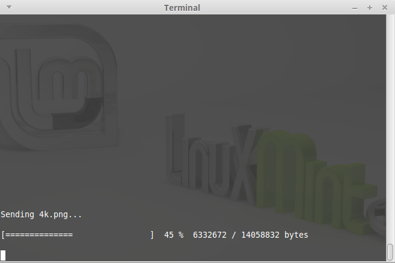
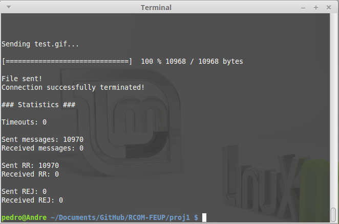

##Data Connection Protocol

We used a script "port.sh" that can virtual emulate a connection through a serial port, you can execute that script by running:

```
sh port.sh
```

It's recomended to install ```socat``` to use this script.


Run the ```make``` command to compile the project and execute it by running ```./app```


***Screenshots***







